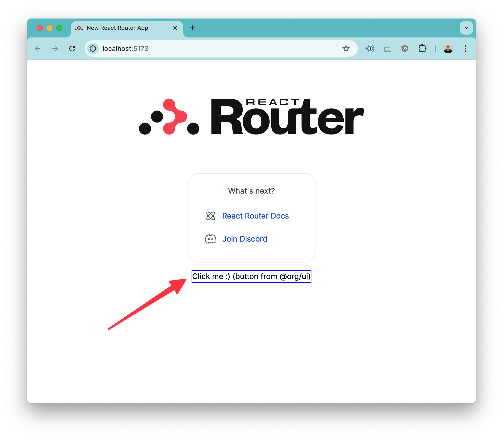

# pnpm + no-build libs

A demo to show that when using Vite, we might not need to build packages to consume them within a monorepo.

## Running

First, install the dependencies with `pnpm`:

```bash
pnpm install
```

Now, you can start the website:

```bash
pnpm run dev
```

The React Router app will be hosted at [http://localhost:5173/](http://localhost:5173/).

If you open the [`apps/website/app/routes/home.tsx`](apps/website/app/routes/home.tsx) file, you'll see a `Button` component being imported and rendered without any errors:



This button is coming directly from [`./packages/ui/src/button.tsx`](packages/ui/src/button.tsx).

### No Build Step

Note that there's no build step configured. The only requirement is to have an entry point ([`packages/ui/src/index.ts`](packages/ui/src/index.ts)) that exports the entire library/package code. This allows the website to directly import components like this:

```tsx
import { Button } from "@org/ui";
```

If you change the `Button` component code, Vite automatically picks up the changes, and the server is refreshed.
